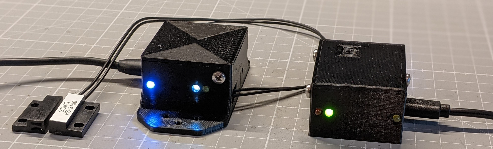
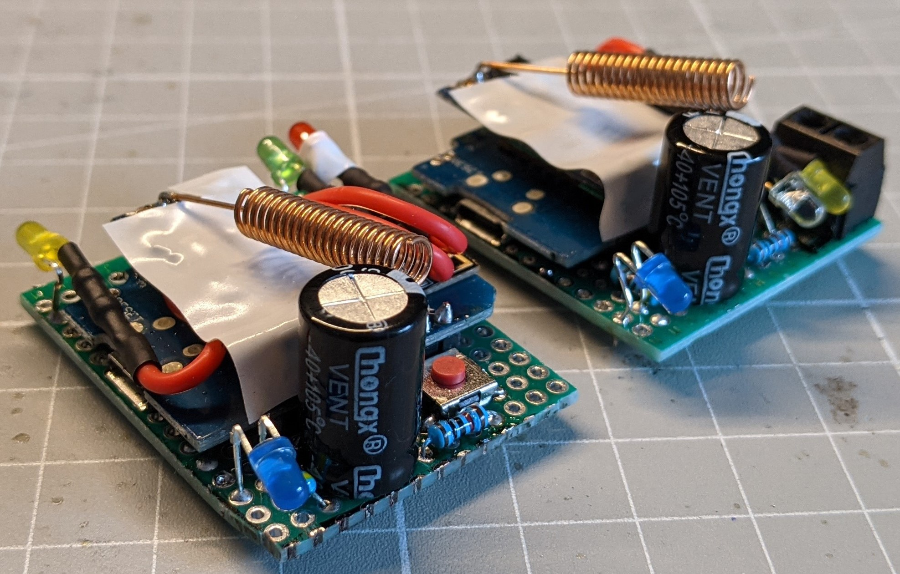
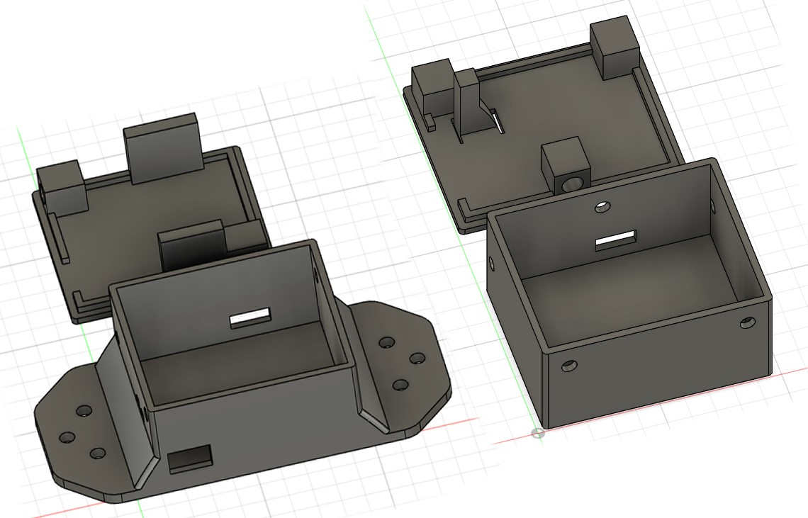
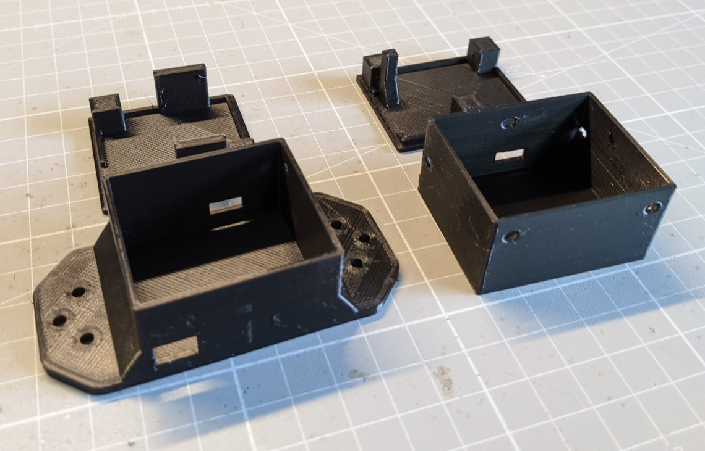
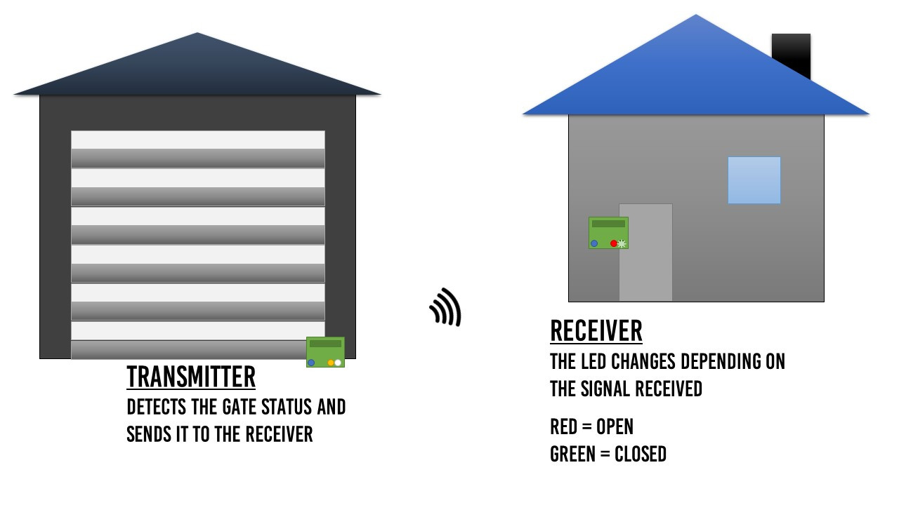
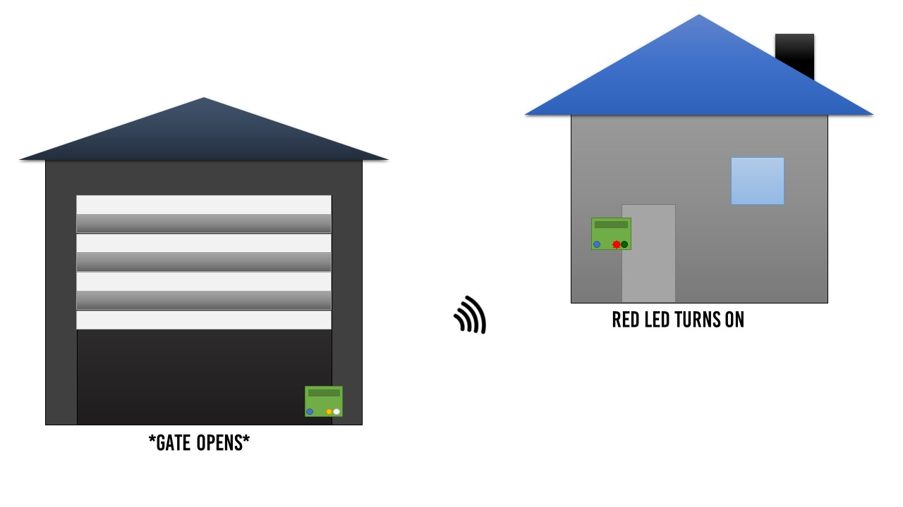

# DoorStatusIndicator

## Description

***Note: This is an old (local) project of mine, last updated in August 2021.***

This project is a door status indicator consisting of a receiver and a transmitter code, each running on an ESP8266. The purpose of this system is to indicate the status of any door, such as a garage door, whether it is open or closed, using LEDs and a wireless communication module (HC-12). The code is designed to establish and monitor the connection between the two modules.

## Receiver

The receiver code is responsible for receiving signals from the transmitter and indicating the garage door's status using LEDs. The green LED indicates that the door is closed, while the red LED indicates that it is open. A button offers the possibility of a manual connection check to the transmitter.

## Transmitter

The transmitter code monitors the status of the garage door with the help of a switch, for example a hall sensor. It sends the door status wirelessly to the receiver via the HC-12 module. 

## Hardware

- ESP8266 (Wemos D1 mini)
- HC-12 wireless communication module
- LEDs for status indication
- Sensor for detecting the garage door state

---

| PCBs |
|--|
|  |  

| Housing CAD | Housing print |
|--|--|
|  |  |

| Functional image | Gate opens scenario |
|--|--|
|  |  |

